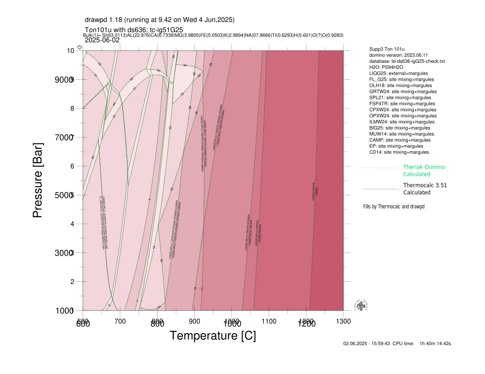

# Comparison of ds636-igG25 Translation with THERMOCALC 3.51
The diagram below is for tonalite ton101u bulk composition, as obtained from 
Supplemental 3 with the Green et al. (2025) paper. The diagram was calculated 
in both THERMOCALC 3.51 and Theriak-Domino (June 2025). The dataset file used
in Theriak-Domino is td-ds636-igG25-check.txt, now distributed as td-ds636-ig51G25-v1.txt.
The THERMOCALC, drawpd, and files used to construct the THERMOCALC version of
the diagram is from the HPx-eos website (May 2025).

## Diagram
The fills and solid black assemblage boundaries are from THERMOCALC, and the dashed green
lines are from Theriak-Domino, with P-T grids superimposed. The THERMOCALC diagram is
adequately reproduced in Theriak-Domino.

